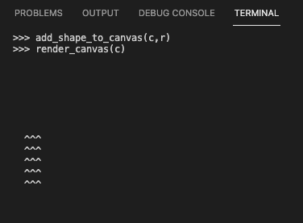
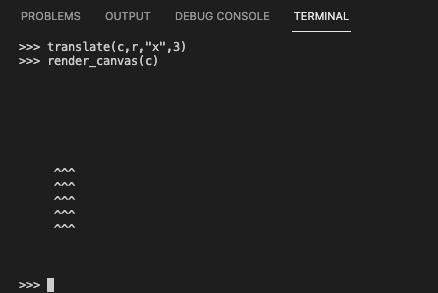
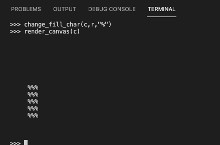
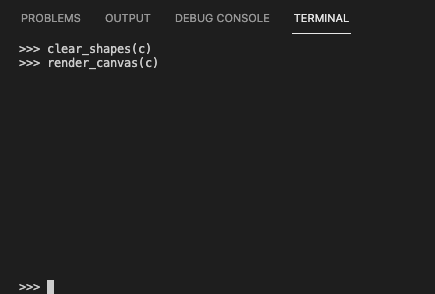
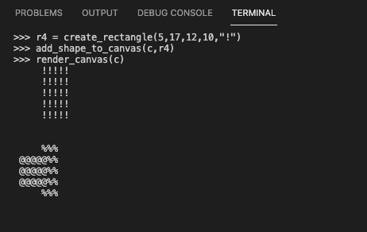

# Hackbright Take Home

I implemented an API for drawing and manipulating rectangles on a canvas. I used object-oriented programming with Python to implement the API.

## How to use the API

1. After cloning the repo, install dependencies

   `$ pip3 install -r requirements.txt`

2. Open an interactive console

   `$ python3 -i takehome.py`

3. Play around with the functions below (in Features) to try out the features!

## Features

- Create the canvas with a specified height and width

  `>>> c = create_canvas(15,10)`

- Render the canvas on the console

  `>>> render_canvas(c)`

- Create a rectangle with a specified fill character and (x,y) coordinates for the upper-left-hand corner and the lower-right-hand corner

  `>>> r = create_rectangle(2,7,4,3,"^")`

- Add the rectangle to the canvas

  ```
  >>> add_shape_to_canvas(c,r)
  >>> render_canvas(c)
  ```

  

- Translate rectangle (move up/down or left/right)

  ```
  >>> translate(c,r,"x",3)
  >>> render_canvas(c)
  ```

  

- Change a rectangle's fill character

  ```
  >>> change_fill_char(c,r,"%")
  >>> render_canvas(c)
  ```

  

- Clear all shapes from a canvas

  ```
  >>> clear_shapes(c)
  >>> render_canvas(c)
  ```

  

\*\*The most recently added rectangle appears on top of other rectangles


\*\*Characters out of bounds of the canvas are not rendered


